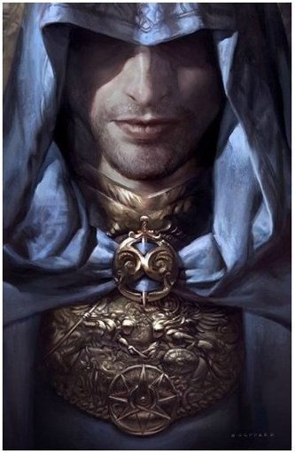

# Projeto Final C207L2 - C206L1

## Descrição
Skyrim V
A história do jogo acontece cerca de 200 anos após os eventos de Oblivion, durante o ano 201 da 4th Era (4E201). O High King of Skyrim foi morto, e uma guerra civil ocorreu por toda a região. De um lado, os que desejavam se separar do império agora em ruínas. Do outro, os que ainda queriam permanecer como parte dele, acreditando na preservação de valores. 
Para piorar a situação, uma profecia de Elder Scrolls anunciava o retorno dos dragões de Alduin, o deus nórdico da destruição.

  

## Conceitos
Foram feitas algumas aplicações no projeto com base nos conceitos aprendidos em C206 e C207, como:
- Classes;
- Classes Abstratas;
- Herança;
- Polimorfirmos;
- Interface de interação;
- Java collections;
- Maven;
- CRUD;
- Relacionamentos;

## Funcionalidades do código
- O código é um jogo baseado no formato Decision Making;
- O código exibe as características do seu personagem e dos inimigos que você enfrentar;
- Encena a batalha e atualiza os dados enquanto os exibe no console;

